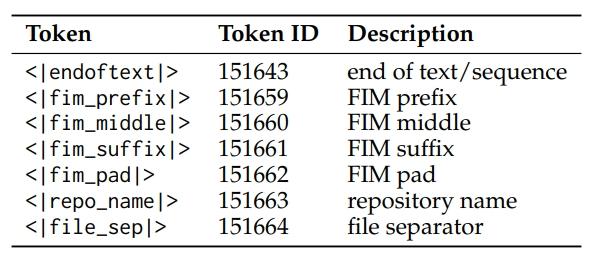
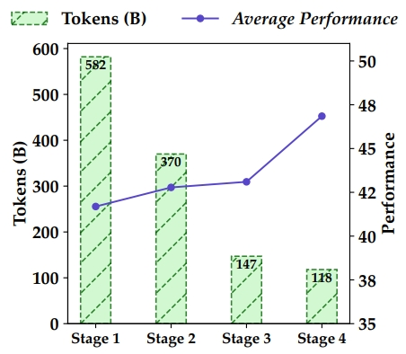

# Qwen2.5-Coder 技术报告详细解读

[toc]

> [!tip]
>
> - **这不是技术报告的翻译**，全文人工撰写
> - 这只是个人的解读，如果有问题欢迎探讨
> - 笔者能力有限，全文可能难以深入到特别细节的理论研究，也不会有什么公式推导
> - 全篇会尽量按照报告的行文顺序来写解读，但中间可能会有些许变化，也不一定会提到报告中每个地方


前一篇：[Qwen2.5-Math 技术报告解读](Qwen2.5-Math 技术报告解读.md)


## 0. 前文

这一篇 Coder 的技术报告风格不同于 Math，整体样式都不太一样：Math 的样式模板和 Qwen Technical Report、Qwen2 Technical Report 保持一致、作者名也都是按照字典序排序的，可以说是更加“正统”；Coder 的样式模板和 DeepSeek 的样式非常类似，有区分一作，并且通讯也只有  Junyang Lin 大佬一个人（只有 2.5 的两篇开始出现了通讯）。

此外，和 Math 模型类似，Code 模型的名称也出现了变动。最开始的一代（只出现在技术报告中、没开源）和 1.5 代的时候，代码模型都叫做 Code-Qwen，但到了 2.5 代就改名成了 Qwen2.5-Coder，这样做更加强调了 Math 和 Code 这类专有模型都同属于 Qwen Series。不过不同于 Math-Qwen 改名为 Qwen-Math，Code-Qwen 变成了 "Coder"，据他们的说法是更加契合于 1.5 时提及的"结对编程"场景。

这次的模型开源了 1.5B、7B 和 32B（coming soon）三个尺寸，没有 Qwen 正统和 Math 模型的最大号 72B。但我个人的感觉是，Code 这样的模型在进化的过程中要么逐渐变小、便于专有化部署和高频使用；要么逐渐把能力整合入主力模型，例如 GPT、Claude 和最近的 DeepSeek，所以我觉得专门的一个更大的代码模型也确实没必要。


## 1. 模型架构

既然都强化了 Qwen2.5 Series 的概念，Qwen2.5-Coder 自然在模型架构上不会有什么分别。报告中只提了 1.5B 和 7B 的架构，但按理来说 32B 的模型架构应该也不会和 Qwen2.5-32B 有区别。不过 Qwen2.5-32B 和 Qwen1.5-32B 不完全一样，中间 FFN 的升维维度从 256 * 107 变成了 256 * 108、也就是向 1024 对齐取整了，不太清楚这里面具体的考量。

这里值得一提的是，Qwen 从 2 代开始加深小模型的深度、削减宽度，并且增大 FFN 升维的维度，这大概也是现在的一个 LLM 主流认识：同样参数下，窄而深的模型会比宽而浅的更好；增大 FFN 维度可以增强表征能力。例如以往 FFN 维度都是 4 倍（对于 LLaMA 这样的 GLU 来说，同参数规模要乘以 2/3，也就是 8/3 倍），但 Qwen 现在都是差不多 16/3 倍，抛开为了 128 或者 256 对齐，0.5B 的模型大概是 16/3 倍、1.5B 大概是 6 倍、7B 大概是 17/3 倍，就连 32B 也是 16/3 倍，只有最大号的 72B 大约是 11/3 倍。具体的数字应该是内部有不同的消融测试才定下来的，但整体趋势是比最开始的 LLaMA2 FFN 升维更高。


## 2. Tokenizer

tokenizer 也和 2 代开始的保持一致，只是 Qwen2.5-Coder 开始为了 FIM（fill-in-the-middle，根据上下文补全代码）任务引入了一些特殊 token，如下：



印象中没记错的话，这些 special tokens 和常用的 FIM 保持一致，没有特别的自定义。

也顺便提一下 FIM 大概是什么任务，其实和字面义显示的一样，就是用于代码补全，给定上下文代码填中间的空：

```
<< 上文代码 >>
{{ 中间需要补全的部分 }}
<< 下文代码 >>
```

由于生成模型只能看到前文，没有双向的注意力，因此我们会把下文放到前面，类似于：

```
<< 上文代码 >>
<< 下文代码 >>
{{ 告知模型，开始生成中间需要补全的部分 }}
```

具体还会有别的设计，我们后文展开讲。例如这里的 `<|repo_name|>` 和 `<|file_sep|>` 就是为了 repo 级别的代码补全而定义的。


## 3. 预训练

### 3.1 数据

**数据组成**

- 来源：主要是 Github，总共 92 种编程语言
- 组成：
    - 代码-文本关联数据（Text-Code Grounding Data）：用了 fastText（没错，还是它，报告提到更大的分类模型没有带来显著收益）做了一个由粗到细的多级过滤，每级都会筛掉一批数据，从 582B tokens 筛选四级降到 118B tokens，但具体如何做的质量过滤并没有细说。同时说明了更高质量但更少的数据也比更多、但质量更良莠不齐的数据效果更好。
    - 合成数据：只说了用 Code-Qwen1.5 进行合成，其余细节没有提及。可以看得出来，随着优质自然语料逐渐消费殆尽、模型性能提升生成效果更好，合成数据从 Post-training 走向 Pre-training 的趋势很明显了。
    - 数学数据：这算是一个共识，数学和代码数据可以相互促进提升能力，具体来说，数学的数据部分是直接拿的 Qwen2.5-Math 的过来用的
    - 文本数据：这里用了 Qwen2.5 的文本数据，并且去除掉了含有代码的部分



**数据混合**

数据混合算是预训练中比较重要的一个问题，因为消融对比的成本非常高，所以如何调配得当、找到一个能力最优平衡点也是一门艺术。

Qwen2.5-Coder 也只做了三个实验来对比文本：代码：数学的混合比例，并且没有提是多大的模型、多少数据量，可能也是成本太高吧。


具体来说，最后选用的代码：文本：数学的数据比例是7：2：1，毕竟 LLM 还是一个文本模型，要是 text 比例不对的话，对通用能力甚至 coding 能力都会有损失。

最终这一部分的数据量达到了 5.2T tokens，但后面还有一个 repo 级别的预训练数据，有 300B，因此预训练数据总量在 5.5T Tokens。


### 3.2 训练


可以看到，图中的 Stage 1 和 Stage 2 就是预训练的两阶段步骤，并且都是在 Qwen2.5 上直接训练的。这里除了常规的 next token prediction 训练以外，还有一个训练任务就是前面提到的 FIM 任务，两阶段的 FIM 训练设计相同，但细节上有所差异。

**文件级别的预训练**

这个就是比较常规的预训练阶段，如前文所说，这里用了 5.2T tokens 的数据，并且相较于 Qwen2.5-Math 的 4K 最大长度，这里翻了一倍、用的是 8K 的最大长度，这和任务特性不同有关。

这里的 FIM 训练格式如下：


其实和我们前面看到的一样，格式很简单：

```python
<|fim_prefix|>		# 特殊 token，用于告诉模型从这里开始往后是「代码上文」
{code_pre}				# 代码上文具体内容
<|fim_suffix|>		# 特殊 token，用于告诉模型从这里开始往后是「代码下文」
{code_suf}				# 代码下文具体内容
<|fim_middle|>		# 特殊 token，用于告诉模型从这里开始往后是「代码中间的部分」
{code_mid}				# 代码中间具体内容
<|endoftext|>			# eot
```

换句话说，FIM 这种格式可以理解为 `<|fim_middle|>` 及之前都是传统 SFT 的 query 部分，往后就是 response 部分，不过预训练的时候应该和普通 next token prediction 一样，计算的是全部 token 的损失、没有 mask，但无论如何，eot 始终是最重要的，FIM 的一些具体训练细节可以见 OpenAI 的[这一篇 paper](https://arxiv.org/abs/2207.14255)。

**Repo 级别的预训练**

Repo 级别的预训练，对于代码模型来说是比较关键的，还是拿代码补全这个下游场景举例，我们的项目往往是跨文件的，这个 class 定义在某个文件、那个 func 又在另一个文件之类的。因此，我们希望模型在补全的时候，能够感知到整个仓库的信息——说白了就是把整个 repo 都喂给模型。此时长上下文能力就显得尤为重要了，因此 Qwen2.5-Coder 做了如下两件事：

- 加入了新的长代码数据，大约有 300B，上下文长度从 8K 提升到了 32K
- 调整了 RoPE 基频（base frequency），从 1e4 扩大到了 1e6，并且延续 Qwen2 的做法，应用 YaRN 可以外推到 132K 上下文

> 这里简单讲一下 RoPE 基频（base）是干嘛的，base 越大、模型长距离衰减越缓，通俗地说，模型能关注到更远的文本，所以长文本能力就更好；
>
> 那么为什么不一味地放大这个 base 呢？** 具体细节可以看 RoPE，简单来说就是 base 越大，相邻 token 越难以区分，就需要更充分的训练。**
>
> 至于 YaRN 是一种应用广泛的外推手段，这里就不细讲了，感兴趣也有很多相关资料可以阅读。

这里也有 FIM 训练任务，格式如下：


相比于文件级别的 FIM，Repo 级别的 FIM 主要是多了前面的部分：

```python
<|repo_name|>{repo_name}		# <|repo_name|> 用于告诉模型这里开始是仓库名
														# {repo_name} 是仓库名本身
<|file_sep|>{file_path1}		# <|file_sep|> 用于告诉模型这里开始是新的文件
														# {file_path1} 是第一个文件路径
{file_content1}							# {file_content1} 是第一个文件的具体内容
...													# 循环 sep、path、content
<|fim_prefix|>{code_pre}...	# 和文件级别的 FIM 一致
```


## 4. Post-Training

### 4.1 数据

数据仍然是训练的最重要部分，相比于预训练，报告详细说明了 Post-Training 中的数据处理部分。

**数据构成**

这一部分其实在原报告中是放在了 training policy 部分的，我们提到前面来说。在后面的训练中会讲到，模型分了两阶段训练，即"由粗到细"的训练方式。

- 第一阶段：数千万个低质量但多样化的指令数据，没提具体数目
- 第二阶段：数百万个高质量指令数据，没提具体数目

**多编程语言数据识别**

这里原文说的是 "nearly 100 programming languages"，应该对应的是前文的 92 种编程语言，不太可能有新增的语种。这里提到两点值得注意：

- 语种分类：分类器用的是微调后 CodeBERT，微软 2020 的一篇工作，可以简单理解为支持代码的 Bert。原本的 Bert 用的预训练语言只有 6 种语言（Go、Java、JS、PHP、Python、Ruby），Qwen2.5-Coder 这里应该是自己构造了数据做微调分类。并且用到了一个"垃圾桶"分类，把无关的（这里是代码含量过少的文本）全部往这个"垃圾桶"分类里塞，一方面符合下游需求，另一方面也能提升模型在常规分类上的表现。
- 长尾丢弃：长尾数据——或者说小众编程语言数据——会被随机地丢弃一部分，但主流语言数据不会动。不清楚这样做的具体缘由，猜测可能是长尾数据总量过多过杂的话，也相当于主流编程语言的噪声？

**合成数据**

这里合成数据用的是打分过滤的方式，报告提到了三种组成部分：

- GitHub：这里主要从 GitHub 采集了大量无监督代码语料，然后针对 1K tokens 以内的语料，用 LLM 生成 query（没提具体什么模型），再用代码 LLM 生成 response（也没提具体什么模型），最后用 LLM 打分过滤（还是没提具体什么模型）

- 第二种：这里原文写得我看得有些迷糊，我把原文贴在这里，给出一个我自己的理解：与第一种构造方式相反，这里是先给定代码片段，然后让模型生成 response，再根据 response 生成 query。至于 response 的内容，我猜可能是代码功能描述、代码扩展续写之类的任务

    > Given the code snippets of different programming languages, we construct an instruction dataset from the code snippets. To increase the diversity of the instruction dataset. Conversely, we first generate the answers from the code. Then we use the LLM scorer to filter the low-quality to obtain the final triplet.

- 开源数据集：就是把一些公开数据集拿过来用

**多编程语言指令数据**

不得不说，这部分我个人感觉有点抽象，可能是 Agent System 本身都是这样的吧（

这部分主要是说用 Agent 构建指令数据，我读得也不算特别明白，先讲一下报告中的流程：

1. Language-Specific Intelligent Agents，构建语言专精的 Agent。这里没提具体 Agent 是怎么构建的，只笼统地说是通过对应语言数据训练而来的
2. Collaborative Discussion Protocol，协作讨论协议。这一步非常有 Agent 的感觉了，讲的主要是类似于 Multi-Agent 式的交互，也就是说这些 Agents 会交互、协作并生成新的 code 指令
3. Adaptive Memory System，自适应记忆系统。说实话，这个部分我不太理解 "adaptive" 的定语含义，看上去说的就是一个动态的、可更新的 Agent Memory，可能对应"动态"？这一部分的作用主要是存储生成过的样本、避免重复
4. Cross-Lingual Discussion，跨语言讨论。更加没理解了，原文提到这是一种新的知识蒸馏技术（a novel knowledge distillation technique），但大概就是不同语言的 Agent 之间可以相互交流自己语言的特性知识，可能这也算一种"传授"？
5. Synergy Evaluation Metric，协同评估指标。这个部分比较有意思，对应上文，这里开发了一个新的指标来量化模型内不同编程语言之间的知识共享和协同程度，但不清楚具体是怎么做的
6. Adaptive Instruction Generation，自适应指令生成。这里的 "adaptive" 应该也是对应的 "动态"，意思就是这里会根据不同语种的 Agents 之间的跨语言能力差异来动态生成新指令

由于报告没有给出一个 Agent 的具体例子，接下来我大概按照自己的理解描绘一个流程示例：

0. 首先我们假设这个 Agent System 有一个强而有力的中央 Controller，可以操控、调整 Agents
1. 假设我们假设构建了三个 Agents，分别是精通 Python 的 $A_p$、精通 Java 的 $A_j$ 和精通 C++ 的 $A_c$
2. 协作：三个 Agents 在 Controller 的指引下，开始提出问题，假设 $A_p$ 提出了一个问题说要计算一组数字的平均数，$A_p$ 提出可以直接用 `sum(list) / len(list)`，$A_j$ 提出可以使用泛型 `<T extends Number>`，$A_c$ 提出可以说用指针 `*lst` 直接操作内存，总之就是各自基于语言特性提出问题和方案
3. 更新记忆：每个 Agents 都记住曾经提出过一个计算平均数的问题，于是后面避免和它重复
4. 知识蒸馏：这一步确实没太理解，可能是特性分享？例如 $A_p$ 可能会分享动态类型，$A_j$ 会分享 GC 机制，$A_c$ 会分享模板元编程。但还是不清楚这里的"分享"和"传授"是怎么操作的
5. 评估+生成：利用开发的跨语言指标进行评估，例如判断出当前模型（不是 Agent）在 C++ 上偏弱，例如模型只会用 Python 和 Java 进行快速排序，但是还不会用 C++，那么接下来就会补充更多 C++ 快排的指令数据。这点很好理解，缺啥补啥，主要是不清楚这个跨语言评估是如何做的

总的来说，这一部分还是缺乏比较多的细节，期待后面有可能能有更深入的资料和探讨。

**Checklist 模式的指令数据打分**

这部分就比较常规了，什么是 Checklist 模式呢？其实就类似于英语考试那样的评分表，比如语言表述是否流畅（0-3分）、是否有语法错误（0-3分）、用词高级程度（0-3分）……这里 Qwen2.5-Coder 主要从 9 个维度打分：

- 问答一致性：检查指令的基本正确性，例如前后要求是否一致
- 问答相关性：是否和计算机领域相关
- 问答难度
- 是否含有代码
- 代码正确性：检查指令答案的代码是否正确
- 码风是否良好
- 代码的清晰度
- 代码注释
- 指令的教育价值

最后再给每个部分赋上权重，权重是预先定义好的，例如一致性占 20%、其余占 10% 等等，具体权重报告里没有提。

这种打分方式直接且有效，很多工作都这么做，但其实也有一些问题：

- 打分的维度如何确定？一般这种打分维度都是人为预先定义的，也就是天然存在 bias，当然也可以说这种 bias 本身就是一种 preference，所以可能问题不太大
- 不同维度的权重如何确定？同上，权重也都是人为定义的
- 谁来打分？如果用人工打分倒是没太大问题，就类似于向人类偏好对齐了，只是实际操作中由于成本，肯定都是由另外的 LLM 来进行打分，最多人工辅助给示例或审查。报告里也没提是否引入人工、如果用 LLM 用的是什么模型（一般是更大更强的模型，例如 GPT-4o），所以我们不得而知。

**用于代码验证的多语言沙箱**

沙箱（Sand Box），简单来说就是一个隔离环境，可以执行代码，很多 LLM 执行代码都是通过沙箱来完成的。为什么要用隔离环境呢？一方面是怕 LLM 自身犯傻，要是直接写出一个死循环代码跑在本机上那全部都崩了；另一方面也是防御攻击注入，比如通过某些高超的越狱手段让 LLM 写出并执行了一些侵入性或者破坏性代码，沙箱就能把这些攻击和本机隔离开。

这里沙箱没有特别多要提的，验证上也都是一些主流手段，就不赘述了。不过这里提到是有引入人工定期更新代码示例库的，推测上面打分也是类似。


### 4.2 训练

相较于数据部分的充实，这里训练只是提了两个部分。

**由粗到细的两阶段训练**

数据量前文提过了，具体训练细节上也没讲特别多，主要有：

- 粗阶段：没提什么，大概是最普通的 SFT，没特别多 trick
- 细阶段：提到了拒绝采样，拒绝采样算是老朋友了，可以看我前一篇 [Qwen2.5-Math 技术报告详细解读](Qwen2.5-Math 技术报告详细解读.md) 中有一些看法，这里也稍微提一下，大概就是一种过滤低分指令、选择高分指令的模式

**混合训练**

这里提到，SFT 数据往往都偏短，于是引入 FIM 数据来构造长上下文的指令数据。为什么 FIM 更长？让我们回忆一下前文，假设我们有一条 FIM 数据，长这样：

```
<< 代码上文 - 3K tokens >>
<< 代码下文 - 4K tokens >>
{{ 期望填充的部分 }}
```

那么我们转为 SFT 数据，例如最简单的加上一句"请根据上下文代码填充中间内容"：

```
query: << 代码上文 - 3K tokens >>\n<< 代码下文 - 4K tokens >>\n\n请根据上下文代码填充中间内容。
response: {{ 期望填充的部分 }}
```

这么一来，就非常容易利用到 FIM 数据的特性，构建出长上下文的 SFT 数据了。当然报告中没提构建的具体方法和例子，我这里只是随便打个比方。

不过我们该如何构建 FIM 数据呢？能不能直接随机的 mask 掉代码里的一部分来构建 FIM 数据呢？其实这是不太合适的，因为在实际的下游任务和场景中，更多的是例如语句级别、函数级别这样相对完整的一个小块来补全的，如果训练的时候是残缺的一部分就有 gap 了。

例如我们希望：

```python
...

# 注释代表 mask 掉
# def add(foo, bar):
#     return foo + bar
# 
# result = add_foo_bar(5, 10)

...
```

这里的 `add` 函数要是能被完整 mask、作为待填充目标就很合适；但我们不希望：

```python
...

# 星号代表 mask 掉
**************ar):
    return foo + bar

result = add_foo_bar(5, 10)

...
```

因此，我们需要"成块"、相对完整地摘取代码中的某一部分。如果学过编译的朋友应该就能猜到接下来的做法了，没错，就是利用 AST（抽象语法树）。通俗来说，这个 AST 的确就是一棵树，一层一层地节点就像代码中一层一层地包裹、深入，那么我们可以找到某个节点、整个地摘除作为填充预测目标，这样就保持完整性了。

这里用到了一个好用的工具——tree-sitter，印象里 2020 年微软的 GraphCodeBERT 工作就有用到。这个简单理解就是一个解析器，支持非常多的编程语言，可以很容易的得到一份代码的 AST，并且鲁棒性也很好，一些有错误的代码也能解析。

最后报告提到，混合的数据里面 FIM 只占一小部分。


## 5. 去除数据集污染

和 Qwen2.5-Math 类似，Qwen2.5-Coder 当然也要去除数据集污染（Decontamination）。简单来说，就是排除掉训练集中可能被污染、和测试集相同或高度相似的部分，避免模型在测试集或者榜单上分数虚高。

Qwen2.5-Coder 用的是 10-gram 去重。


## 6. 评估

又到了评估部分，这一部分重要、但没太多可说的，大概就是 Qwen2.5-Coder 在各大榜单上取得了优异成绩。

先说一些常见的榜单，例如 HumanEval 和 MBPP，这些暂时没有像 GSM8K 那样饱和，但主要问题是语种单一、只有 Python 问题。当然后面 Qwen2.5-Coder 也测了 MultiPL-E，一个涵盖八种主流语言的 benchmark，但还是远少于模型训练的 92 种语言，所以我们也不知道中间提到的跨语言能力对齐的 Agent 部分具体效用如何，希望有一个更加完善的 benchmark。

这里 Qwen2.5-Coder 还测了数学能力，也的确佐证了代码和数学能相互促进。那么具体怎么样呢？因为分了很多个表格，大概就是：

- Base 模型：同规模比 Qwen2 数学略强，弱于 Qwen2.5-Math 和 Qwen2-Math（Qwen2.5 主系列没放基座结果）
- SFT 模型：这个由于没有经过 RL，因此比 Math 系列弱了不少；但是却比经过 RL 的 Qwen2-Instruct 强（Qwen2.5 主系列没放 7B 以下的性能）

还测了一下 Text2SQL 的性能，也很不错。

此外，相较于前两天出的 Yi-Coder 如何呢？对比了一下两家官方自己报告的数据，在相信两家自己报告的性能的情况下（应该也没啥问题，不至于），Qwen2.5-Coder 还是更强的。我猜测没对比的原因是因为 LLM 在榜单上的性能本身就有浮动，各家报告性能真实性应该是可以保证的，但是没复现他人的模型情况下，一般还是较为谨慎报告的。

尽管我在评估部分提的比较简略，但是报告原文是写得很详实的，感兴趣的可以去原文详细阅读。


## 7. 总结

相比于 Qwen2.5-Math 的技术报告，这一篇 Coder 的技术报告更加工程化，但很可惜还是缺少一些关键细节，希望后面能有更多的资料补充。

以上均是我通读后的个人解读，可能有不少疏忽或错误，欢迎指出和探讨。